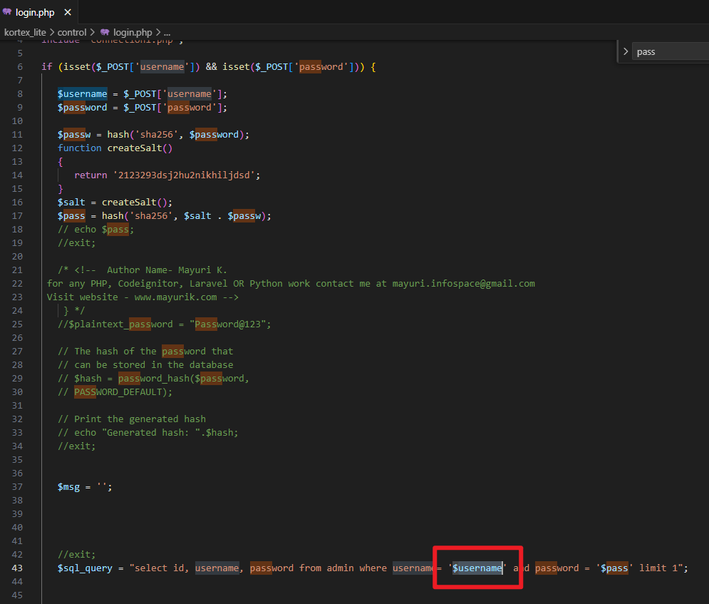

# Advocate office management system login.php time-based SQL Injection Vulnerability

* **Exploit Title**: Advocate office management system login.php time-based SQL Injection Vulnerability
* **Exploit Author**: webraybtl@webray.com.cn inc
* **Vendor Homepage**: https://www.sourcecodester.com/php/17280/advocate-office-management-system-free-download.html
* **Software Link**: https://www.sourcecodester.com/download-code?nid=17280&title=Advocate+office+management+system+free+download
* **Version**: Advocate office management system v1.0
* **Tested on:**  PHP 7.4.33, OpenResty1.21.4.3-3-3-focal
* **CVE:**  Reported, waiting for CVE number.

## Description

Advocate office management system login.php `username`​ parameter has a time-based SQL injection Vulnerability.

#### Payload used

> mayuri.infospace@gmail.com'and sleep(3) -- '

## Proof of Concept

* Visit the login page, fill in the email and password, click login to get the post

  Request package.
* Construct the post request package and send it to the login.php. Successfully saw that the response time was delayed by the specified number of seconds.

​​

* Upon reviewing the source code, it was discovered that the `username`​ parameter was directly concatenated into the SQL statement.

​​
